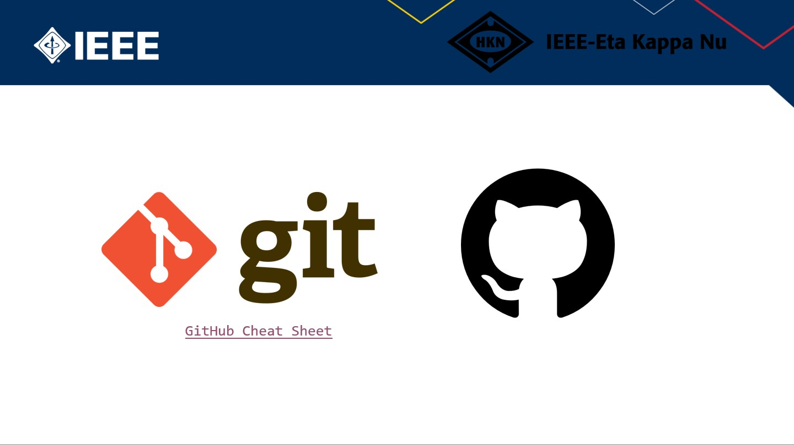
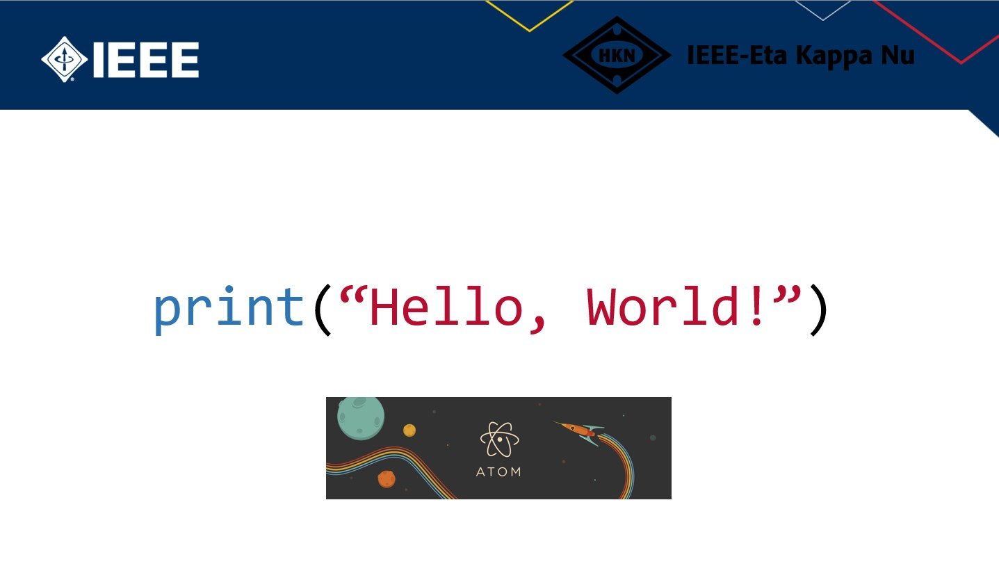

# GitHub Fundamentals 📓
HKN GitHub Fundamentals 

### Welcome Everyone! 
### In this workshop we are going to go over the basics of GitHub and all of its core components

This workshop is about…

* Basics about GitHub and its features
* How to access GitHub and its repositories
* Make, publish, and share content in GitHub
* Integration with Text Editors

## Git vs GitHub ⚔️

[Git Cheat Sheet](https://training.github.com/downloads/github-git-cheat-sheet.pdf)
[WorkFlow](https://guides.github.com/introduction/flow/)

## Github Interface 📜
Git is a version control system that lets you manage and keep track of your source code history. GitHub is a cloud-based hosting service that lets you manage Git repositories. If you have open-source projects that use Git, then GitHub is designed to help you better manage them.

## Print Hello, World! 👋

